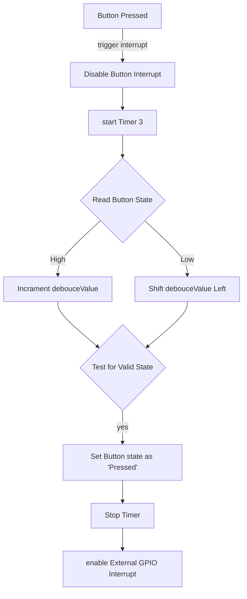

# Week 3 Assignment - Blinky

## Overview
This weeks assignment was to create a blinky app with a button to allow the LED to blink or not.

The push button needed to be debounced with the option of using interrupts. 

## Build Environment

IDE : SMT32CubeIDE  
Repository : Git  
Repository manager : Fork (I prefer this to the IDE's built in tools for git)

## Board used
For this assignment I used the STM32F401RE which may well be used for my final project.

### Processor modules used
- Timer 3 - for debounce routine
  - Using timer interrupt
- LD2 - The board'd build in LED
- User Push Button - the board's build in push button
- - Using EXT0 interrupt on falling edge

## Registers

Port and Pin assignments relevant to the STM32F401RE NUCLEO board.
The Reference Manual is RM0368

For GPIO:
Set GPIO Pin Mode : GPIOx_MODER (set as input, output, analog or Alternate)

GPIO - LED : This is initialised as an output bit on Port A, pin 5. Register used is GPIOx_ODR

GPIO - Button : This is initialised as an Input on Port C, Pin 13. The register used to read the pin state is GPIOx_IDR


## Code Modules

### Flashing LED
The flashing of the LED is simply implemented in the main app loop along with a 500ms delay. The program first checks if the button has been pressed (see below) and sets the LED control state accordingly.  
The push button controls weather or not the state of the LED can be changed.

The loop then calls the 'ledToggle' function. This function will either toggle or not depending on the LED control state value. 

### LED Controller
ledController.c  
ledController.h

The Led Controller is a simple module that controls the state of the LED (either on or off) and whether the state can be changed or not. 

The module uses the HAL_GPIO driver (Initiated in GPIO_Init function)  and references the #defines of LD2 as specified in the main.h file.

### Debounce Controller
debounceController.c  
debounceController.h

This controller manages the debounce of the push button switch. This is a simpler version of the debounce process, only allowing for a single button state of 'pressed' or 'not pressed'.

Theory applied.

The push button is configured to trigger an interrupt on the falling edge of the signal with GPIO Pull-UP enabled.

When the button is pressed the first falling edge triggers the interrupt and immediately disable any further interrupts from the button. Timer 3 is then started which is configured to trigger its own interrupt when the predefined period is completed.  

Timer 3 samples the state of the button. If the button is pressed (ie in this configured state - Low), then the debouceValue is shifted to the left by one. 
If, however the sample reads High (Ie a bounce is happening) the debounceValue is incremented by one. 

Each sample of either a left shift or increment occurs at the pre defined sample rate of timer 3 (see calculation below). This way, it is easy to test the debouceValue for a button push of x time as the debounceValue for that portion of the bits will be 0 by the end of the sampling process. 

Once its been determined that its a valid button press, a 'buttonPressed' variable is set which is then used in the main loop polling. 

To test if its a valid button press, the value of the debounceValue needs to be Zero corresponding to the number of bit sampled. 
```
if ((debounceValue & ((1<<10)-1)) == 0)
```
This code will return true of all bits from bit 0 to bit 10 are zero. This will only happen if the 1st bit (initialised to 1) is left shifted for the detrermined number of samples. 

Bits after bit 10 are not important. 

Note (1<<10)-1 results equates to 0000011111111111 - It is the first 10 bits that we want to test for. 

This routine allows up to easily test for a period where the button state is stable with the minium about of run-time calculations

#### Timer 3 Calculation.

I used a period of 50ms to define a valid button press. The sampling rate is set as 5ms, so it takes 10 samples test for a valid button press. 

Timer 3 is therefor set to 5ms period. In order to achieve this the following parameters were used.

> frequency = clkFreq / (PSC+1) * (ARR+1) 

The clock for Timer 3 is on APB1 which is configured for 84Mhz


In order to achieve 5ms I need a frequency of 200Hz

>  1/200 = 0.005

First step was to divide the Timer clock (prescaller) by 84 in order to reduce the clock to 1Mhz
Second step was to divide the clock again using the ARR (automatic reload register) to 5000

 > 1000000/5000 = 200Hz

As the registers are 0 index based the following parameters were used

> frequency = 84Mhz/ (83+1) * (4999+1) 
to give an exact frequency of 200hz.

Note : There is approx 1.4% tolerance 




