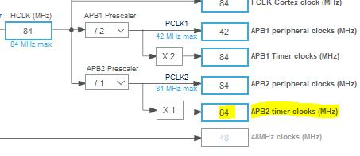

# Week 3 Assignment - Blinky

## Overview
This weeks assignment was to create a blinky app with a button to turn of the blinking LED or turn it on. 

The push button needed to be debounced with the option of using interrupts. 

## Board used
For this assignment I used the STM32F401RE whic may well be used for my final project.

### Processor modules used
- Timer 3 - for debounce routine
- LD2 - The board'd build in LED
- User Push Button - the board's build in push button
- - Using EXTI interrupt on falling edge
- 
- 

## Code Modules

### LED Controller
ledController.c
ledController.h

The Led Controller is a simple module that controls the state of the LED (either on or off) and wether the state can be changed or not. 

The module uses the HAL_GPIO driver to, Initiated in GPIO_Init and references tha defines of LD2 as specified in the main.h file.

#### void setLedControlState(uint8_t state)
Sets a variable 'ledControlEnabled'. When TRUE (1) the LED can be switched on/off or toggled. 

### void ledControlStateToggle()
Toggles the ledControlEnabled variable between 1 and 0

#### void ledToggle()
if ledControlEnabled the LED will be toggled to ots opposite state

#### void ledOff()
Turns the LED Off by writing 0 to the Pin
#### void ledOn()
Turns the LED On by writing 1 to the pin

### Debounce Controller

This controller manages the debounce of the push button switch. This is a simpler version of the debounce, only allowing for a single button state of Pressed or not pressed.

Theory applied.

The push button is configured to trigger an interrupt on the falling edge of the signal with GPIO Pull up enabled.

When the button is pressed the first falling edge triggers the interrupt and immediately disable any further interrupts. Timer 3 is then started which is configured to trigger its own interrupt when the predefined period id completed.  

Timer 3 samples the state of the button. If the button is pressed (ie in this configured state - Low), then the debouceValue is shifted to the left by one. 
If, however the sample reads High, Ie a bounce is happening the debounceValue is incremented by one. 

Each sample of either a left shift or increment occurs at the pre defined sample rate of timer 3 (see calculation below). This way, it is easy to test the debouceValue for a button push of x time as the debounceValue for that portion of the bits will be 0 by the end of the sampling process. 

Once its been determined that its a valid button press, a 'buttonPressed' Variable is set which is then used in the main loop polling. 

#### Timer 3 Calculation.

I used a period of 50ms to define a valid button press. The sampling rate is set as 5ms, so it takes 10 samples test for a valid button press. 

Timer 1 is therefor set to 5ms period. In order to achieve this the following parameters were used.

$$frequency = clkFreq / (PSC+1) * (ARR+1)$$

The clock for Timer 3 is on APB1 which is configured for 84Mhz

In order to achieve 5ms I need a frequency of 200Hz

$$ 1/200 = 0.005$$

First step was to devide the Timer clock (prescaller) to 84 in order to reduce the clock to 1Mhz
Second step was to device the clock again using the ARR (autamatic reload register) to 5000

$$ 1000000/5000 = 200 $$

As the registed are 0 index based the following parameters were used

$$ frequency = 84Mhz/ (83+1) * (4999+1) $$
to give an exact frequency of 200hz.

