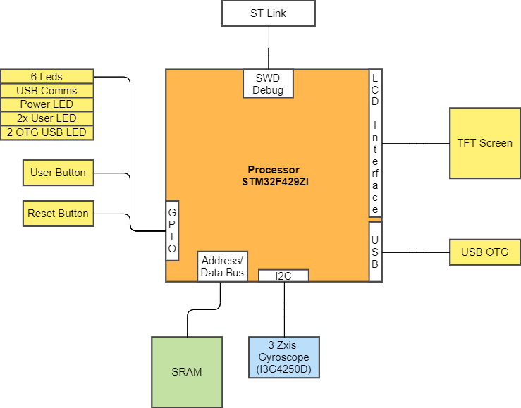

#STM32F429I Discovery board
##Overview

## Processor
The STM32F429I Discovery board uses an STM32F429I (ST) processor which is a high-performance ARM Cortex.

Breakdown of Processor name

The Chip name is broken down as follows:

STM32|F|429|V|I|T|6|xxx
--|---|---|--|--|-|-|-|

Marker|Meaning|Description
------|-------|-----
STM32|Device Family|
F|Product Type| General Purpose
429|Sub Family |USB OTG FS/HS, camera interface, 
Ethernet, LCD-TFT
V|Pin Count|V = 100 Pins
I|Flash Memory Size|I = 2048 Kb
T|Package Type|T = LQFP
6|Temp Range| 6 = -40$^\circ$ to 85$^\circ$ C

**Hardware Block Diagram**

**Notable Dev kit Peripherals**
- 2.4" TFT LCD
- USB OTG
- ST MEMS motion sensor gyroscope
- 64mBit SDRAM
- Onboard ST-LINK
- 

# Processor
## Flash and Ram

RAM|Flash
-|-
1Kb| 2Mb

The chip also has an external memory controller which can use up to 32 bits of address data - 4mb Memory.

The chip has a number of peripherals that are not usually found  on microprocessors. 
The chip is clearly designed for LCD graphic and sound. 

Feature|Notes
-|-|
| LCD parallel interface | 8080/6800 modes
| LCD-TFT controller| fully programmable resolution
| Chrom-ART Accelerator | enhanced graphic content creation
| 17 Timers| 16x 16 bit and 2x 32 bit at 180Mhz 
| SAI| Serial Audio Interface 
|I2S | Inter-Integrated Sound
| CAN | Data network
| Digital Camera Interface

This chip can also support up to 21 communication interfaces

## Analog to Digital Converter (ADC)

The processor has two 12 bit ADC converters with up to 16 external channels.
DMA transfer can be used to store data captured. 

## Board and processor costs?

####SAM E54 Xplained Pro kit
Note : I only checked UK based sites for this exercise. I also only costed for ingle quantity

Vendor|Dev kit Cost|Availability| Processor Cost | Processor Availability
-|-|-|-|-
DigiKey| £22.78 | 10 | £12.80 | 0 
Mouser | £23.77 | 41|£18.62 | 1 year lead time
Farnell | £27.00 | 0|£24.42 |  1 year lead time
RS Online | £38.68| 539 |£14 | 0

## Application Note

There are 49 application notes

Example : AN4666 - Parallel synchronous transmission 
 using GPIO and DMA

