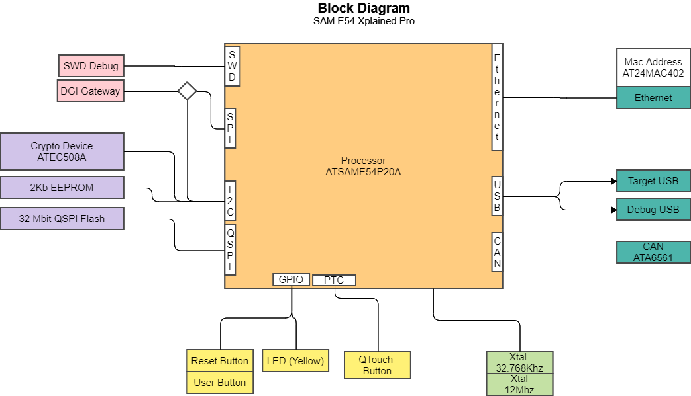

#SAM E54 Xplained Pro
##Overview

## Processor
The SAM E54 Xplained Pro dev board uses an Atmel (Microchip) ATSAME54P20A processor.

Breakdown of Procesor name

The Chip name is broken down as follows:

AT|SAM|E45|P|10|A
--|---|---|--|--|-

Marker|Meaning|Description
------|-------|-----
AT|ATMEL|
SAM|Product Family|Smart ARM Microcontroller
E54|Product Series|Cortex M4F, Advanced Feature Set, Ethernet, 2x CAN
P|Pin Count|120/128
20|Flash Memory Density|1MB
A|Device Variant|Default vertant

**Hardware Block Diagram**

**Notable Peripherals**

This is a Cortex M4 device has a large and varied selection of peripherals which acocunts for the large pin count. Even so, not all pherepherals will be available as some may overlap with each other. 

Most processors will have a similar selection of pheripherals which would include standard communication ports and functions such as watch dog timers.

This chip has a number of periperals that are not usually found  on microprocessaors. 

Feature|Notes
-|-|-
| Wake up pins with tamper and debonce filter| Debouce if offten dealt with in softwere (or external hardware) so interesting to see it implemented on the chip
| Ethernet| Implements 10/100 Mbps and is IEEE 802.3 compatible
| CAN | Control Area network
| Position decoder| This is a Quadrature or Hall decoder osed for Hall sensors or digital rotary encoders.
| Frequency Meter| Frequency Counter at 24 bit accuracy. 
| Configurable Custom logic| This is unusual. Its much like a very simple FPGA or GAL that allows 'glue' logic to be configured. This allows for hardware logic to exist between pheriperals, event system and pins.
| Parallel Capture Controller| Used to interface with an external system like a camera , ADC or DSP. It can clock up to 14 parallel bits 
| Pherpheral Touch Controller| Capacitive touch detection
| Advanced Encryption System| AES encryption module with 256bit key upto 2Mb/s rate! 
| True Random Number Generator|
|RS485| This is unusual as offten coms its just TTL level and an exteral chip is used to convert to RS232 or RS485. RS485 is generally used for long cable communication where the lenth of the bacle can be up to 1km

## Analog to Digital Converter (ADC)

The ATSAME54P20A has two ADC converters which can be configured as 8, 10 or 12 bit resolutions and up to 1M samples per sec.
It can use either internal or external reference and allows dor DMA trasfer. 
It can use up to 23 analog inputs per ADC - 16 of which can be external.

## Board and processor costs?

####SAM E54 Xplained Pro kit
Note : I only checked UK based sites for this excersise. I also only costed for ingle quantity

Vendor|Dev kit Cost|Availabilty| Processor Cost | Processor Availability
-|-|-|-|-
DigiKey| £75 | 195 | £7.19 | 0 - Lead time 52 Weeks
Mouser | £81.76 | 358|£7.99 | 0 - lead time 52 weeks
Farnell | £84.17 | 0- Lead time 106 days! |£10.06 | 0 - 52 weeks lead time
RS Online | £76.46| 45 |£8.49 | 0 - no indication of lead time

## Application Note

The Ket itsself does not have application notes, but the processor does. 

Only one application note seems to exist.

####Sleepwalking with the Event System AN3342
This application note deal with the reducion of power consumption. Sleepwalking is an advanced mode allowing periperals to be woken up without waking the CPU. This allows functions to take place that do not require the CPU such as Momery operations and data collection.

